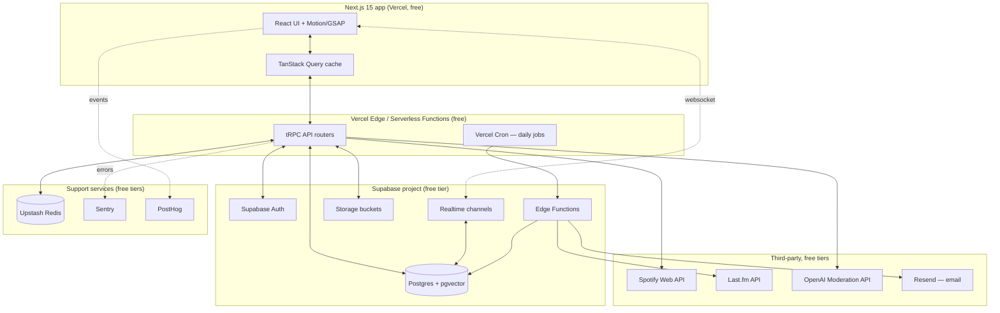

# Cultured — Complete Technical Architecture
### Backend, algorithms, and system design for a $0 pre-seed build

This is the engineering spec that sits underneath the UI/motion prompt already
built. Everything here runs on free tiers — no infrastructure spend until
there's traction (or funding) to justify it. Where a decision trades quality
for cost, that tradeoff is called out explicitly, along with what you'd
upgrade to later.

---

## 1. Guiding principles

1. **One managed backend, not a pile of services.** Supabase (Postgres +
   Auth + Storage + Realtime + Edge Functions) does 80% of the job for free.
   Fewer moving parts = fewer things that break with no ops budget.
2. **Type safety end-to-end.** TypeScript + tRPC + Zod means a schema change
   in the backend breaks the frontend build immediately, not in production.
3. **Compute-cheap algorithms first.** No GPU training jobs, no always-on
   Python services. Everything below runs as SQL, Postgres extensions, or
   plain TypeScript on serverless functions.
4. **Cache aggressively, call external APIs rarely.** Spotify/Last.fm rate
   limits and your own compute budget are both protected the same way.
5. **Design for the free-tier ceiling, not around it.** Every service below
   has enough headroom for real early users (hundreds to low thousands)
   before a single dollar is needed.

---

## 2. System architecture



---

## 3. Free tech stack — full list

| Layer | Service | Free tier limit | Why this one |
|---|---|---|---|
| Hosting + API | Vercel | 100GB bandwidth, unlimited serverless invocations (fair use) | Zero-config Next.js deploys, generous free tier |
| Database | Supabase Postgres | 500MB DB, 2GB egress/mo | Postgres + **pgvector** built in — no separate vector DB needed |
| Auth | Supabase Auth | 50k MAU | Handles phone/email OTP + OAuth out of the box |
| Realtime | Supabase Realtime | Included | Postgres CDC + Presence + Broadcast in one system |
| File storage | Supabase Storage | 1GB, 2GB egress/mo | Same project, same auth rules (RLS) apply to files |
| Image transforms | Cloudinary | 25 credits/mo (~thousands of thumbnail transforms) | On-the-fly resize/crop without storing multiple copies |
| Cache / rate limiting | Upstash Redis | 10k commands/day | Serverless-native (REST API), no persistent connection needed |
| Background jobs | Supabase Edge Functions + Vercel Cron | Generous free quotas | Scheduled daily-drop selection, digest emails |
| Transactional email | Resend | 3,000 emails/mo | Match/message notification emails |
| Text moderation | OpenAI Moderation API | Free, no token cost | Caption/bio moderation before publish |
| Error tracking | Sentry | 5k errors/mo | Frontend + serverless function errors in one place |
| Product analytics | PostHog | 1M events/mo | Funnels — onboarding drop-off, swipe-to-match rate |
| Music data | Last.fm API + Spotify Web API | Free, rate-limited | Per your own blueprint: Last.fm for genre/tag enrichment, Spotify OAuth for the initial pull only |
| CI | GitHub Actions | 2,000 min/mo | Lint, typecheck, test on every PR |

**Nothing above requires a credit card to start**, except Cloudinary/Resend/OpenAI which have free tiers with no forced billing at signup in most cases — double check current terms before connecting a card.

---

## 4. Database schema (Postgres, via Supabase)

Enable the `pgvector` extension first: `create extension if not exists vector;`

```sql
-- USERS
create table users (
  id uuid primary key references auth.users(id),
  name text not null,
  age int not null check (age >= 18),
  gender text,
  orientation text,
  looking_for text check (looking_for in ('dating','friends','both')),
  location geography(point),
  city text,
  bio text,
  photos text[],                -- storage paths
  verified boolean default false,
  spotify_refresh_token text,   -- encrypted at rest via Supabase Vault
  fingerprint_visibility text default 'matches_only'
    check (fingerprint_visibility in ('matches_only','before_matching')),
  created_at timestamptz default now()
);

-- TASTE VECTORS (the core matching data structure)
create table taste_vectors (
  user_id uuid primary key references users(id) on delete cascade,
  humor_vector vector(4),        -- [affiliative, self-enhancing, aggressive, self-defeating]
  music_vector vector(64),       -- weighted frequency over top-64 genre/tag vocabulary
  combined_vector vector(68) generated always as (humor_vector || music_vector) stored,
  interaction_count int default 0,
  updated_at timestamptz default now()
);

-- ANN index for fast candidate retrieval
create index on taste_vectors using ivfflat (combined_vector vector_cosine_ops) with (lists = 100);

-- ANTI-GENRE / ANTI-HUMOR FILTERS
create table user_blocklist (
  user_id uuid references users(id) on delete cascade,
  blocked_tag text,
  primary key (user_id, blocked_tag)
);

-- FEED CONTENT
create table feed_posts (
  id uuid primary key default gen_random_uuid(),
  author_id uuid references users(id),
  type text check (type in ('meme','track','drop')),
  media_url text,
  caption text,
  tags text[],                  -- humor style / genre tags for ranking + filtering
  like_count int default 0,
  laugh_count int default 0,
  comment_count int default 0,
  created_at timestamptz default now()
);

create table reactions (
  post_id uuid references feed_posts(id) on delete cascade,
  user_id uuid references users(id) on delete cascade,
  kind text check (kind in ('like','laugh','save')),
  created_at timestamptz default now(),
  primary key (post_id, user_id, kind)
);

-- SWIPES (Match Matrix history — also training signal for ranking)
create table swipes (
  swiper_id uuid references users(id),
  target_id uuid references users(id),
  action text check (action in ('pass','like','resonate')),
  created_at timestamptz default now(),
  primary key (swiper_id, target_id)
);

-- MATCHES
create table matches (
  id uuid primary key default gen_random_uuid(),
  user_a uuid references users(id),
  user_b uuid references users(id),
  matched_on_post_id uuid references feed_posts(id), -- shared meme/track that triggered it, if any
  taste_score int,                                    -- snapshot at match time
  created_at timestamptz default now(),
  unique (user_a, user_b)
);

-- CHAT
create table messages (
  id uuid primary key default gen_random_uuid(),
  match_id uuid references matches(id) on delete cascade,
  sender_id uuid references users(id),
  content text,
  created_at timestamptz default now()
);

-- LISTENING SESSIONS
create table listening_sessions (
  id uuid primary key default gen_random_uuid(),
  match_id uuid references matches(id) on delete cascade,
  track_id text,
  started_at timestamptz default now(),
  ended_at timestamptz,
  duration_cap_seconds int default 900   -- 15 min free tier cap
);
```

**Row Level Security (RLS)** — enabled on every table. Example policy:

```sql
alter table taste_vectors enable row level security;

create policy "fingerprint visible to self or matched users"
on taste_vectors for select
using (
  user_id = auth.uid()
  or exists (
    select 1 from matches
    where (user_a = auth.uid() and user_b = taste_vectors.user_id)
       or (user_b = auth.uid() and user_a = taste_vectors.user_id)
  )
);
```

This is what makes the "fingerprint visible to matches only" privacy toggle
an actual database-enforced guarantee, not just a UI hint.

---

## 5. Core algorithms

### 5.1 Taste vector representation

- **Humor vector** (4 dims): affiliative / self-enhancing / aggressive /
  self-defeating, each in `[0,1]`. Computed from reactions to Culture Feed
  meme cards: each meme is pre-tagged with a humor-style label (rules-based
  keyword/sentiment tagging at content-creation time — no ML inference cost),
  and a user's vector moves toward the tags of memes they laugh-react to.

- **Music vector** (64 dims): a fixed vocabulary of the 64 most common
  Last.fm tags across your user base. Each user's vector is a normalized,
  TF-weighted frequency count over that vocabulary, built from their top
  artists' tags. Fixed-size and cheap — no embedding model required.

### 5.2 Incremental vector update (runs on every interaction, O(1))

Recomputing a user's whole taste profile from history on every swipe would
be wasteful. Instead, update with an exponential moving average:

```
v_new = normalize( (1 - α) * v_old + α * x_interaction )
```

- `α = 0.15` — recent behavior matters more, but one swipe can't whiplash
  the whole profile.
- `x_interaction` — a one-hot (or tag-weighted) vector for the meme/track
  just reacted to.
- Runs inline in the reaction mutation, no batch job needed.

```typescript
function updateTasteVector(old: number[], interaction: number[], alpha = 0.15): number[] {
  const blended = old.map((v, i) => (1 - alpha) * v + alpha * interaction[i]);
  const norm = Math.sqrt(blended.reduce((s, v) => s + v * v, 0)) || 1;
  return blended.map(v => v / norm);
}
```

### 5.3 Taste Twins compatibility score

```
score = round(100 * cosine_similarity(combined_vector_A, combined_vector_B))
```

Done directly in SQL using pgvector's `<=>` (cosine distance) operator —
no application-layer math needed for pairwise comparisons:

```sql
select 1 - (a.combined_vector <=> b.combined_vector) as similarity
from taste_vectors a, taste_vectors b
where a.user_id = $1 and b.user_id = $2;
```

### 5.4 Match Matrix candidate ranking (the queue a user swipes through)

```typescript
async function getCandidateQueue(userId: string) {
  // 1. ANN retrieval — top 200 nearest by taste vector, pre-filtered
  const candidates = await db.query(`
    select u.id, u.*, 1 - (tv.combined_vector <=> me.combined_vector) as taste_sim
    from users u
    join taste_vectors tv on tv.user_id = u.id
    cross join (select combined_vector from taste_vectors where user_id = $1) me
    where u.id != $1
      and u.id not in (select target_id from swipes where swiper_id = $1)
      and not (u.tags && (select array_agg(blocked_tag) from user_blocklist where user_id = $1))
      and st_dwithin(u.location, (select location from users where id = $1), :max_distance_m)
    order by tv.combined_vector <=> me.combined_vector
    limit 200
  `, [userId]);

  // 2. Re-rank with a weighted score
  const scored = candidates.map(c => ({
    ...c,
    score: 0.7 * c.taste_sim
         + 0.2 * proximityScore(c.distance_km)
         + 0.1 * recencyBoost(c.created_at) // slight boost to newer profiles
  }));

  // 3. Cold-start exploration: 20% of the queue is deliberately diverse,
  //    not just top-similarity, so low-interaction users still get signal
  //    to refine their vector against (epsilon-greedy, ε = 0.2)
  const exploit = scored.sort((a, b) => b.score - a.score).slice(0, 16);
  const explore = sampleRandom(candidates, 4);
  const queue = interleave(exploit, explore);

  // 4. Cache for 10 minutes so re-fetching the tab doesn't recompute
  await redis.set(`queue:${userId}`, JSON.stringify(queue), { ex: 600 });
  return queue;
}
```

### 5.5 Culture Feed ranking

Simple weighted scoring is enough at MVP scale — true collaborative
filtering (matrix factorization) is a v2 upgrade once there's enough
interaction volume to train on:

```
feedScore = engagementVelocity(post) * recencyDecay(post.created_at)
          + 0.15 * tasteSimBoost(post.author, viewer)   // small nudge toward similar-taste authors
          - diversityPenalty(consecutiveSameType)         // don't show 3 memes in a row
```

### 5.6 Daily Drop selection (runs once/day via cron)

```typescript
// Supabase Edge Function, scheduled 00:00 UTC
async function selectDailyDrop() {
  const meme = await db.query(`
    select id from feed_posts where type='meme' and created_at > now() - interval '48 hours'
    order by (like_count + laugh_count * 2) desc limit 1
  `);
  const track = await pickEditorsPickTrack(); // small curated pool, rotated weekly
  await db.insert('feed_posts', { type: 'drop', meme_id: meme.id, track_id: track.id });
}
```

### 5.7 Last.fm rate-limit handling (their API caps at ~2 req/sec)

Two layers, both free:

1. **Cache first, always.** Genre/tag data barely changes — cache each
   artist's tags for 7 days in Postgres (`artist_tag_cache` table) or
   Upstash Redis. This alone eliminates ~95% of would-be API calls.
2. **Token bucket for the remainder**, in Upstash Redis:

```typescript
async function checkRateLimit(): Promise<boolean> {
  const key = 'lastfm:bucket';
  const tokens = await redis.get(key) ?? 10;
  if (tokens <= 0) return false;
  await redis.decr(key);
  return true;
}
// A Vercel Cron job refills the bucket to 10 every 5 seconds
```

### 5.8 Anti-genre / anti-humor filtering

Pure SQL array exclusion — no ranking cost, applied as a `where` clause
before the ANN search runs (see 5.4), so blocked-tag candidates never
enter the expensive similarity computation at all.

---

## 6. Backend architecture

### 6.1 API layer — tRPC routers

```
/server/routers
  auth.ts           — signup, OTP verify, session
  users.ts          — profile CRUD, photo upload
  fingerprint.ts     — get/update taste vectors, privacy toggle
  feed.ts           — infinite feed query, react mutation (optimistic)
  matches.ts        — candidate queue, swipe mutation, match creation
  chat.ts           — message send/list (paired with Realtime subscription)
  listeningSession.ts — start/end session, track picker
  settings.ts       — blocklist, discovery prefs, account actions
```

Every procedure is Zod-validated on input and typed on output — the
frontend TanStack Query hooks get full autocomplete and compile-time
errors if the contract drifts.

### 6.2 Auth

Supabase Auth handles phone/email OTP natively. Spotify isn't a built-in
provider, so it's a manual OAuth (PKCE) flow: a tRPC procedure exchanges
the auth code for tokens, stores the refresh token in Supabase Vault
(encrypted column), and a serverless function refreshes the access token
on demand before each Spotify API call.

### 6.3 Realtime

Three uses of Supabase Realtime, all free and included:

- **Postgres CDC** — subscribe to `insert` on `messages` filtered by
  `match_id`, pushes new chat messages instantly to both clients.
- **Broadcast channel** — Listening Session play/pause/seek events,
  low-latency peer sync without a dedicated WebSocket server.
- **Presence** — "typing…" indicators, online status.

### 6.4 Background jobs

- Vercel Cron (free, up to 2 jobs on Hobby plan — enough here) triggers a
  Supabase Edge Function nightly for Daily Drop selection and weekly for
  digest emails via Resend.
- Rate-limit bucket refill runs on a 5-second cron via the same mechanism.

### 6.5 Caching

Upstash Redis (REST-based, works from serverless without connection
pooling headaches) caches: candidate queues (10 min TTL), Last.fm
responses (7 day TTL), rate-limit counters.

### 6.6 Media & moderation

- Uploads go straight to Supabase Storage from the client (signed URL),
  never through your own server — keeps serverless function time low.
- Cloudinary free tier handles resize/crop on request via URL params —
  one stored original, infinite derived sizes.
- Text (captions, bios) run through OpenAI's free Moderation API before
  publish. Image moderation at zero cost is the one real gap here — for
  now, rely on user reporting + a manual review queue (a simple admin
  table + Supabase Studio as your "admin panel") rather than paying for
  vision moderation. Flag this as the first thing to budget for once
  there's any funding.

### 6.7 Security

- RLS on every table (see 4. above) — the database itself enforces who
  can read what, independent of API bugs.
- Zod validation on every input, no exceptions.
- Secrets (Spotify client secret, service role key) live only in Vercel
  server-side env vars, never shipped to the client bundle.

---

## 7. Frontend–backend contract & "smoothness"

- **TanStack Query + tRPC**: every mutation (swipe, react, send message)
  updates the local cache optimistically before the server confirms —
  the UI never waits on a round trip to feel responsive.
- **Prefetching**: while the user is deciding on the current Match Matrix
  card, the next candidate's data is already prefetched in the background.
- **Streaming SSR** (Next.js Server Components) for the initial Feed and
  Profile loads — content appears before all JS has hydrated.
- **PWA**: a Workbox service worker (via `next-pwa`, free) makes the app
  installable to a home screen and gives it an offline app-shell — real
  "app feel" with zero app-store cost or review process.
- **Realtime, not polling**: chat and listening-session sync use Supabase
  channels, not interval-based fetching — this is both smoother and
  cheaper on your function-invocation quota.

---

## 8. Observability

- **Sentry** (free 5k events/mo) — catches both client-side React errors
  and serverless function exceptions in one dashboard.
- **PostHog** (free 1M events/mo) — funnels for onboarding drop-off,
  swipe-to-match conversion, feed engagement. This is the data that
  eventually justifies (or redirects) a fundraise.
- **Vercel Analytics** (free) — Core Web Vitals, no setup.

---

## 9. CI/CD

- GitHub Actions (free 2,000 min/mo): typecheck + lint + test on every PR.
- Vercel auto-generates a preview deployment per PR, production deploy on
  merge to `main`.
- Supabase schema migrations live in `/supabase/migrations`, applied via
  the Supabase CLI in a GitHub Action step on merge.

---

## 10. Cost ceiling — what breaks first

| Service | Free limit | Roughly supports |
|---|---|---|
| Supabase DB | 500MB | Tens of thousands of users at this schema's row sizes |
| Supabase Storage | 1GB | ~2-4k compressed profile photo sets |
| Supabase Auth | 50k MAU | Far beyond pre-seed scale |
| Vercel bandwidth | 100GB/mo | Thousands of daily active sessions |
| Upstash Redis | 10k commands/day | Fine until real concurrent traffic |
| Resend | 3,000 emails/mo | Hundreds of active daily matches |

**Storage is the first likely ceiling** (photo-heavy app). When you approach
it: compress on upload client-side before it ever reaches Storage — that
alone buys significant headroom before Supabase Pro ($25/mo) is needed.

---

## 11. Scaling path (later, not now)

In priority order, once there's a reason to spend:
1. Supabase Pro ($25/mo) — when DB nears 500MB or you need backups.
2. A dedicated small Python service (FastAPI on Render) — once humor
   classification needs a real transformer model instead of rules-based
   tagging.
3. Paid image moderation (Google Cloud Vision / AWS Rekognition) — before
   any public launch beyond a closed beta, this is a trust/safety
   priority, not optional.
4. Larger pgvector indexes or a dedicated vector DB (Pinecone) — once the
   candidate pool passes roughly 100k users and ANN query latency degrades.

---

## 12. Repo structure

```
/app                    — Next.js App Router pages
/server
  /routers              — tRPC procedures (section 6.1)
  /lib
    vectors.ts           — 5.1–5.3 vector math
    ranking.ts            — 5.4–5.6 ranking algorithms
    rateLimit.ts           — 5.7 token bucket
/components             — UI (from the motion/design prompt)
/lib
  supabase.ts            — client + server Supabase instances
  redis.ts               — Upstash client
/supabase
  /migrations            — SQL schema (section 4)
  /functions             — Edge Functions (daily drop, digests)
.github/workflows        — CI (section 9)
```

## 13. Environment variables checklist

```
NEXT_PUBLIC_SUPABASE_URL=
NEXT_PUBLIC_SUPABASE_ANON_KEY=
SUPABASE_SERVICE_ROLE_KEY=        (server only)
UPSTASH_REDIS_REST_URL=
UPSTASH_REDIS_REST_TOKEN=
SPOTIFY_CLIENT_ID=
SPOTIFY_CLIENT_SECRET=            (server only)
LASTFM_API_KEY=
OPENAI_API_KEY=                   (moderation only)
RESEND_API_KEY=
SENTRY_DSN=
NEXT_PUBLIC_POSTHOG_KEY=
```
